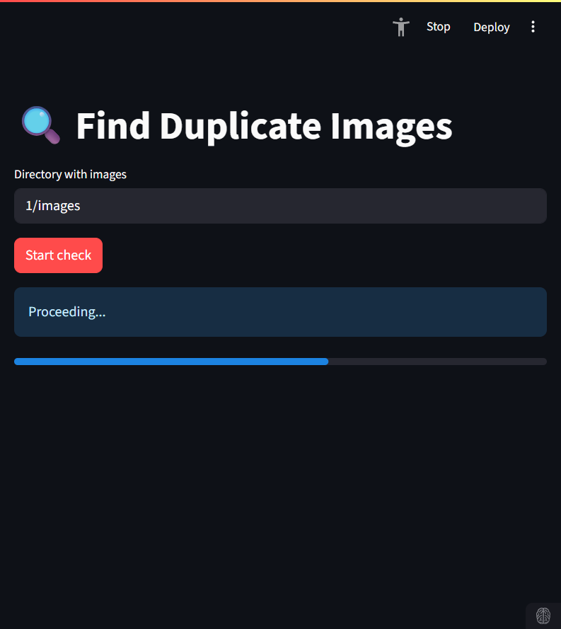
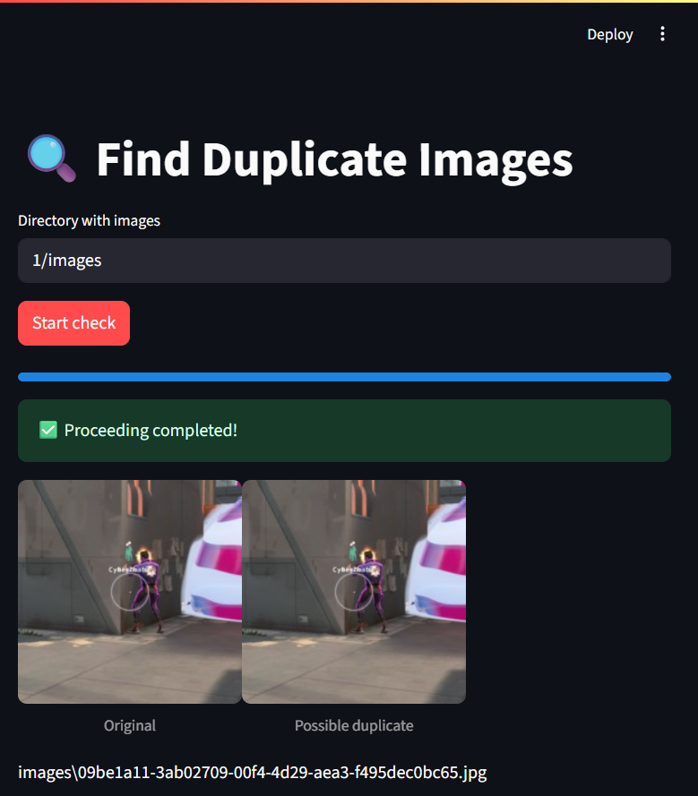

# Duplicate Image Finder 🔍



This project helps you find duplicate images in a directory using multiple hash functions. It combines cryptographic hashing, perceptual hashing, and custom convolution-based hashing techniques to identify both exact duplicates and visually similar images.

## Key Features
- Multiple hashing techniques:
  - SHA256 (exact file matching)
  - Perceptual Hashing (imagehash)
  - Custom Convolution Hash 
  - Sobel Edge Detection Hash 
  - Image Sharpening Hash 
- Visual comparison of potential duplicates 
- Streamlit web interface for easy interaction 
- Skip functionality to ignore false positives

## Installation
Use [uv](https://github.com/astral-sh/uv) to install dependencies
```bash
uv sync
```

## Usage
Use uv
```bash
uv run streamlit main.py
```
... or use Docker
```bash
docker build -t duplicate-image-finder .
docker run -p 8501:8501 duplicate-image-finder
```
